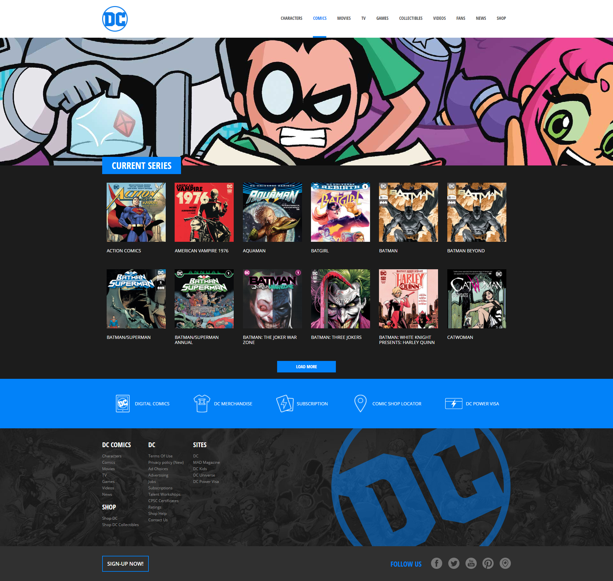

# Laravel Comics

### Svolgimento ✅

L'obiettivo è replicare il layout di un sito basandoci sullo screenshot!

Creiamo un file di layout in cui inserire la struttura comune di tutte le pagine del sito web (tag head, tag body, ...) eventualmente includendo header e footer tramite due partials.

Creiamo poi una rotta per visualizzare la lista di tutti i fumetti recuperati dal file comics.php che trovate in allegato,  inserendoli nella cartella config e abbelliamo il tutto sfruttando SASS.

 

### Bonus 1

Creare più pagine istituzionali che condividono lo stesso layout

### Bonus 2 ✅

Creare uno o più componenti da condividere tra le varie pagine